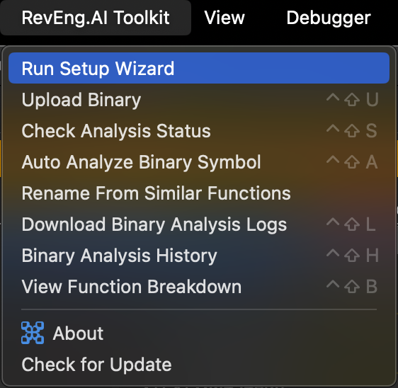
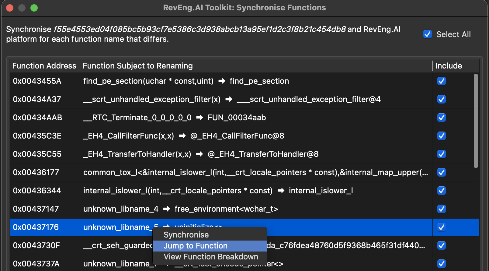

Official IDA Pro Plugin for [RevEng.AI](https://reveng.ai/).

### Features Supported

Below a non-exhaustive list of the features supported by the plugin:
* **AI Decompiler**: RevEng.AI’s decompiler currently supports both ELF and PE files
* **Auto-Unstrip**: A one-click operation to automatically unstrip stripped binaries within the plugin
* **Function Name Recovery**: Renames unknown functions in stripped binaries to similar function names using RevEng’s BinNet® model
* **Summaries**: Generates AI-powered summaries for analysed functions
* **Synchronization**: Synchronises data types, function names, and more across different Software Reverse Engineering (SRE) suites
* **Function Matching**: Matches functions across your RevEng.AI collections, libraries, and more
* **Logs**: Provides full visibility into analyses through detailed logs

# Installation & Running 🚀

## Step 1: Locate Your IDA Pro Plugins Directory

First, you need to find where IDA Pro stores its plugins.

1. **Open IDA Pro**
2. **Access the Python console** (usually under `File > Script command` or `Alt + F7`). This may already be docked in the lower-portion of your IDA instance
3. **Run the following command:**
   ```python
   import idaapi
   print(idaapi.get_user_idadir() + "/plugins")
   ```

**Expected output locations:**
- **Windows:** `%APPDATA%\Hex-Rays\IDA Pro\plugins`
- **macOS/Linux:** `~/.idapro/plugins`


> 💡 **Tip:** Please copy this path - you'll need it in the next step!

## Step 2: Download and Install the Plugin

1. **Visit the releases page:** https://github.com/RevEngAI/reai-ida/releases
2. **Download the latest release** (look for the most recent version)
3. **Extract the downloaded archive** to your plugins directory from Step 1
4. **Verify the folder structure:** The extracted folder should be named `revengai` and placed directly in your plugins directory

Your final structure should look like:
```
[plugins directory]/
└── revengai/
    ├── [plugin files...]
    └── requirements.txt
```

## Step 3: Install Plugin Dependencies

Install the required Python packages directly from IDA Pro's Python console.

1. **In IDA Pro's Python console** (the docked console you used in previous steps), run:
   ```python
   import subprocess
   import sys
   import os

   python_path = os.path.join(sys.prefix, 'python.exe') if os.name == 'nt' else os.path.join(sys.prefix, 'bin', 'python3')
   
   plugins_dir = idaapi.get_user_idadir() + "/plugins/revengai"
   requirements_path = os.path.join(plugins_dir, "requirements.txt")
   
   subprocess.check_call([python_path, "-m", "pip", "install", "-r", requirements_path])
   ```

## Verification

1. **Restart IDA Pro** completely
2. **Check the plugins menu** you should see the RevEng.AI plugin listed
3. **Load a binary file** and try accessing the plugin features outlined below

## Setup & Usage 📦

Open IDA, the plugin should be visible under `RevEng.AI` menu.



If `RevEng.AI` menu does not appear in the menubar, you can:
- either click on  displayed in the toolbar
- or click on `Edit > Plugins` then `RevEng.AI`


Before using the plugin, it needs to be configured. Select `Run Setup Wizard` from the menu shown in the previous image.

A popup should appear that contains the main configuration window for the plugin like below:


Fill in the API key and host information - the model drop-down will automatically populate when clicked on `Continue`. This only works if the entered configuration information is valid.

Once this is done you are now ready to use the plugin.

## Processing Binaries

Before we do any analysis we need to upload a file. Uploading a file is available via the IDA Views of the code or from the pseudocode window by right-clicking.


Select `Process Binary`, it will automatically ask whether you want analysis to be done on the file. Currently the analysis does not support customisation but will in the future.


Once the file has been sent for analysis, an analysis ID is automatically set internally so any future actions that are specific to an analysis will use this ID.

You can check the status of your request by selecting `Check Analysis Status` from either of the menus like before.

The status of any previous analysis done can be viewed by selecting `Binary Analysis History` from the popup menu, an example of this menu is in the next screenshot.


**A right click allows you to delete, view analysis report or set as current analysis for the selected analysis**

## Binary Synchronisation

When a previously analysed binary is selected, a popup-window is displayed, prompting you to synchronise all local functions whose name differs from that present on the RevEng.AI platform. 



**A right click allows you to sync, jump to or breakdown the selected function**

## Function Renaming

#### Rename a Function

Right-clicking on any function name in an IDA View and selecting `Rename From Similar Functions` will bring up the following window that lets you rename a function.


Currently, all available functions from all binaries are displayed in order of similarity confidence. The user is able to filter on both binary and confidence levels


Selecting an entry from the list and then pressing `Rename` will cause the function to be renamed within IDA.

**A right click allows you to rename or breakdown the selected function**

#### Analyse Binary

You can also batch analyse the binary to rename functions using the `Analyse Binary`.


This tool pull the list of collections you have access to on your account, and allows you to specify which collections you want to be included in your binary analysis by clicking on the checkbox. Selecting no collections will enable all the available collections in your search.

Move the slider to determine the confidence level you want to use for batch renaming. Any function returned that is higher than this value will automatically be renamed in the listing view. Clicking the `Fetch Results` button will kick-off the analysis, which you can track in the progress bar.


Once the analysis is complete, the results panel is enabled. This provides information on what symbols can be renamed, and to what, along with a message explaining why the change occurred.


## AI Decompiler

The AI decompiler is available from the `RevEng.AI` menu. It allows you to decompile a function using the RevEng.AI platform. The decompiled code is displayed in a new window.

First you have to click on the top menu `RevEng.AI` and select `Functions` submenu, then click on `AI Decompiler`.


Wait for the decompilation to finish, and the decompiled code will be displayed in a new window.


# Troubleshooting

- Only IDA v8.0 or later is supported with Python 3.9 and higher.

# Software Requirements

RevEng.AI IDA uses:
- [reait](https://github.com/RevEngAI/reait)
- [libbs](https://github.com/binsync/libbs)
- [tree-sitter](https://github.com/tree-sitter/tree-sitter)
- [pygments](https://github.com/pygments/pygments)

### Development

Ensure the latest version of the [reait](https://github.com/RevEngAI/reait/releases) package is installed with the version of Python IDA is using.

### Disclaimer
The Hex-Rays name, logo, and trademarks are the property of Hex-Rays SA. This project is not affiliated with, endorsed by, or sponsored by Hex-Rays SA.