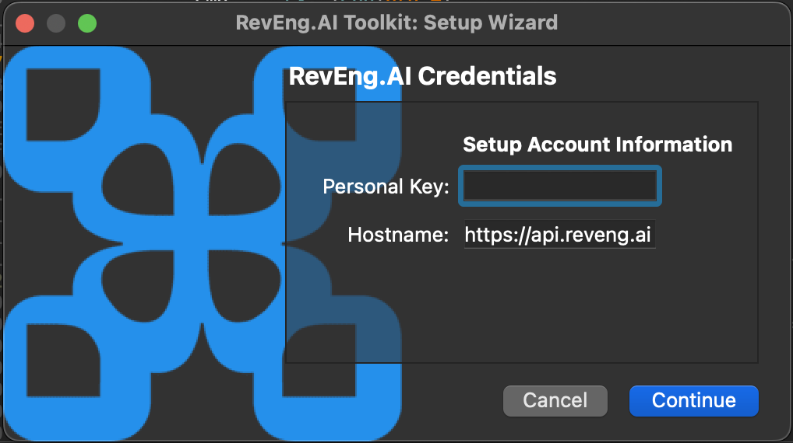
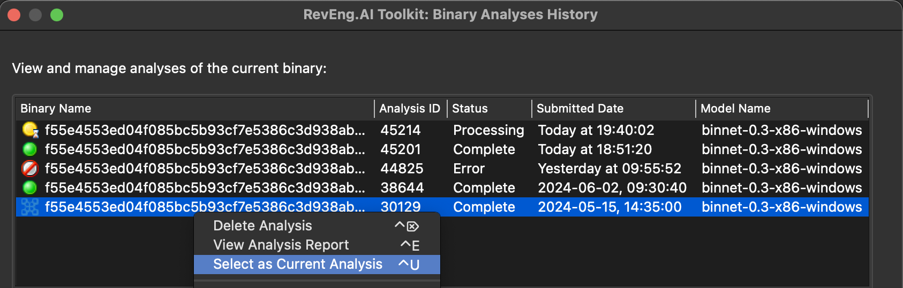
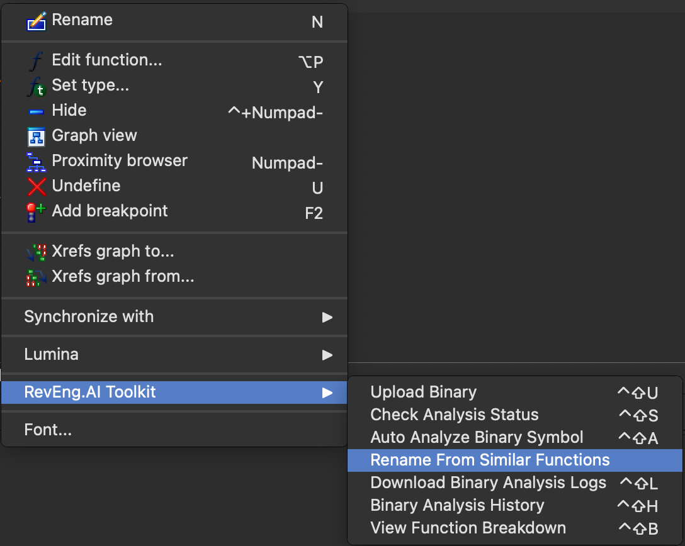
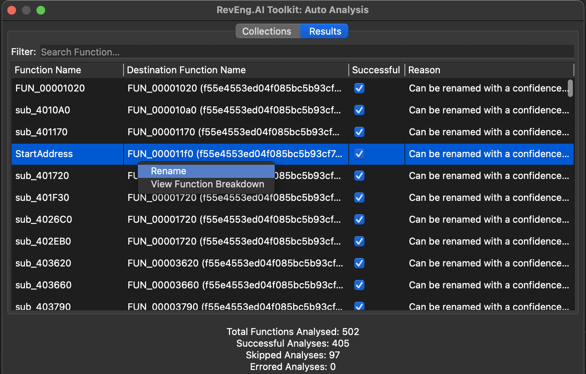

# RevEng.AI IDA PRO Plugin

IDA Pro Plugin for [RevEng.AI](https://reveng.ai/).

### Supported Functionality:

- Uploading of binaries for analysis to RevEng.AI platform
- Downloading logs for analysis from RevEng.AI platform
- Removing analysis from RevEng.AI platform
- Renaming of function names given with similar binaries
- Configuration and persistence of plugin configuration (API key, host, model selection and analysis)

# Install

Install the required Python libraries: `pip install -r requirements.txt`. Copy `revengai` dir and `reveng.py` to the `plugins` dir inside IDA Pro installation dir (or `~/.idapro/plugins` on MacOS and Linux).

### Details

Check the version of Python your IDA Pro installation is using by opening IDA and running `sys.path` inside the Python console. You need to ensure that the dependencies are installed by the version of Python IDA is using. You can then run `{{path to python version}} -m pip install -r requirements.txt`. For example, `$ /Library/Developer/CommandLineTools/Library/Frameworks/Python3.framework/Versions/3.9/bin/python3.9 -m pip install -r requirements.txt`

### Development

Ensure the latest version of the [reait](https://github.com/RevEngAI/reait) package is installed with the version of Python IDA is using.

## Setup & Configuration
Open IDA and if the plugin has loaded successfully it should be visible under `RevEng.AI Toolkit` menu.

Before using the plugin, it needs to be configured. Select `Run Setup Wizard` from the menu shown in the previous image.

A popup should appear that contains the main configuration window for the plugin like below:

Fill in the API key and host information - the model drop-down will automatically populate when clicked on `Continue`. This only works if the entered configuration information is valid.

Once this is done you are now ready to use the plugin.

## Uploading Files

Before we do any analysis we need to upload a file. Uploading a file is available via the IDA Views of the code or from the pseudocode window by right-clicking.

Select `Upload Binary`, it will automatically ask whether you want analysis to be done on the file. Currently the analysis does not support customisation but will in the future.

Once the file has been sent for analysis, an analysis ID is automatically set internally so any future actions that are specific to an analysis will use this ID.

You can check the status of your request by selecting `Check Analysis Status` from either of the menus like before.

The status of any previous analysis done can be viewed by selecting `Binary Analysis History` from the popup menu, an example of this menu is in the next screenshot.

**A right click allows you to delete all selected analyses**

## Function Renaming

#### Rename from Similar

Right-clicking on any function name in an IDA View and selecting `Rename From Similar Functions` will bring up the following window that lets you rename a function.

Currently all available functions from all binaries are displayed in order of similarity confidence. The user is able to filter on both binary and confidence levels

Selecting an entry from the list and then pressing `Rename` will cause the function to be renamed within IDA.

#### Auto Analysis
You can also batch analyse the binary to rename functions using the `Auto Analyze Binary Symbol`.

This tool pull the list of collections you have access to on your account, and allows you to specify which collections you want to be included in your auto analysis by clicking on the checkbox. Selecting no collections will enable all the available collections in your search.

Move the slider to determine the confidence level you want to use for batch renaming. Any function returned that is higher than this value will automatically be renamed in the listing view. Clicking the `Fetch Results` button will kick-off the analysis, which you can track in the progress bar.

Once the analysis is complete, the results panel is enabled. This provides information on what symbols can be renamed, and to what, along with a message explaining why the change occurred.

## Function Explanation

You can also use the plugin to generate a function comment that can be useful for explaining what the function is doing.

Select the function you are interested in, and from the decompiler view select `Explain This Function` from the right-click menu.

# Troubleshooting
- Only IDA v8.0 or later is supported with Python 3.9 and higher.

# Software Requirements

RevEng.AI IDA uses:
- [reait](https://github.com/RevEngAI/reait) (version >= 1.0.0)
