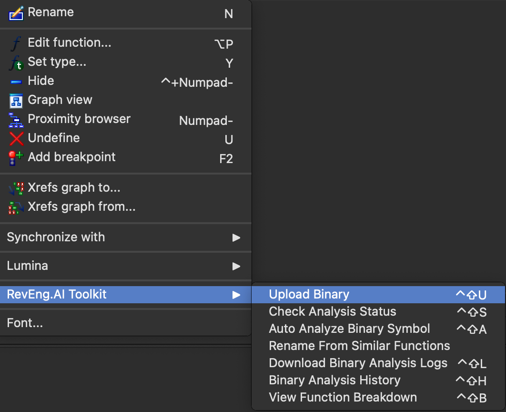

# RevEng.AI IDA PRO Plugin

IDA Pro Plugin for RevEng.AI

### Supported Functionality:

- Uploading of binaries for analysis to RevEng.AI platform
- Renaming of function names given with similar binaries
- Configuration and persistence of plugin configuration (API key, host, port and model selection)

# Install
Copy revengai dir and revengai.py to the `plugins` dir inside IDA Pro installation dir

## Setup & Configuration
Open IDA and if the plugin has loaded successfully it should be visible under `View -> RevEng.AI`.

Before using the plugin, it needs to be configured. Select Configuration from the menu shown in the previous image.

A new tab should appear that contains the main configuration window for the plugin like below

Fill in the API key, host and port information - the model drop-down will automatically populate when clicked. This only works if the entered configuration information is valid.

**The check button does not currently work as the endpoint is not available yet**

Once this is done you are now ready to use the plugin.

## Uploading Files

Before we do any analysis we need to upload a file. Uploading a file is available via the IDA Views of the code or from the pseudocode window by right-clicking

Select `Upload`, it will automatically ask whether you want analysis to be done on the file. Currently the analysis does not support customisation but will in the future.

Once the file has been sent for analysis, an analysis ID is automatically set internally so any future actions that are specific to an analysis will use this ID.

The status of any previous analysis done can be viewed by going back to the congfiuration window and selecting the `Uploads` tab on the LHS. Right-clicking on the file of interest and selecting `Status`, an example of this menu is in the next screenshot

**By selecting an entry in this list it will update the internal binary ID used - if you do not want to change it and just view the status of your recently submitted analysis, select `Cancel`**

## Function Renaming
Right-clicking on any function name in an IDA View and selecting `Rename Function... / Analyse...` will bring up the following window that lets you rename a function.

Currently all available functions from all binaries are displayed in order of similarity confidence. The user is able to filter on both binary and confidence levels

Selecting an entry from the list and then pressing `Rename Function` will cause the function to be renamed within IDA.

# Troubleshooting
- Tested against IDA Pro 8.3/8.4
- Some logging messages go to the `Output` window
- Logging also goes to the log file `%TEMP%\revengai\REVENG.LOG`
- Configurations persisted to `%TEMP%\revengai` dir

# TODO
- Potentially update configuration/log file writing location to a new place using IDA api.
- ~~Filter function ANN using confidence slider~~
- ~~Add ability to get status for a given analysis~~
- Function explanation
- File auto-analysis
- Expand filtering to include names of functions/collections
- ~~Update README with screenshots etc~~

